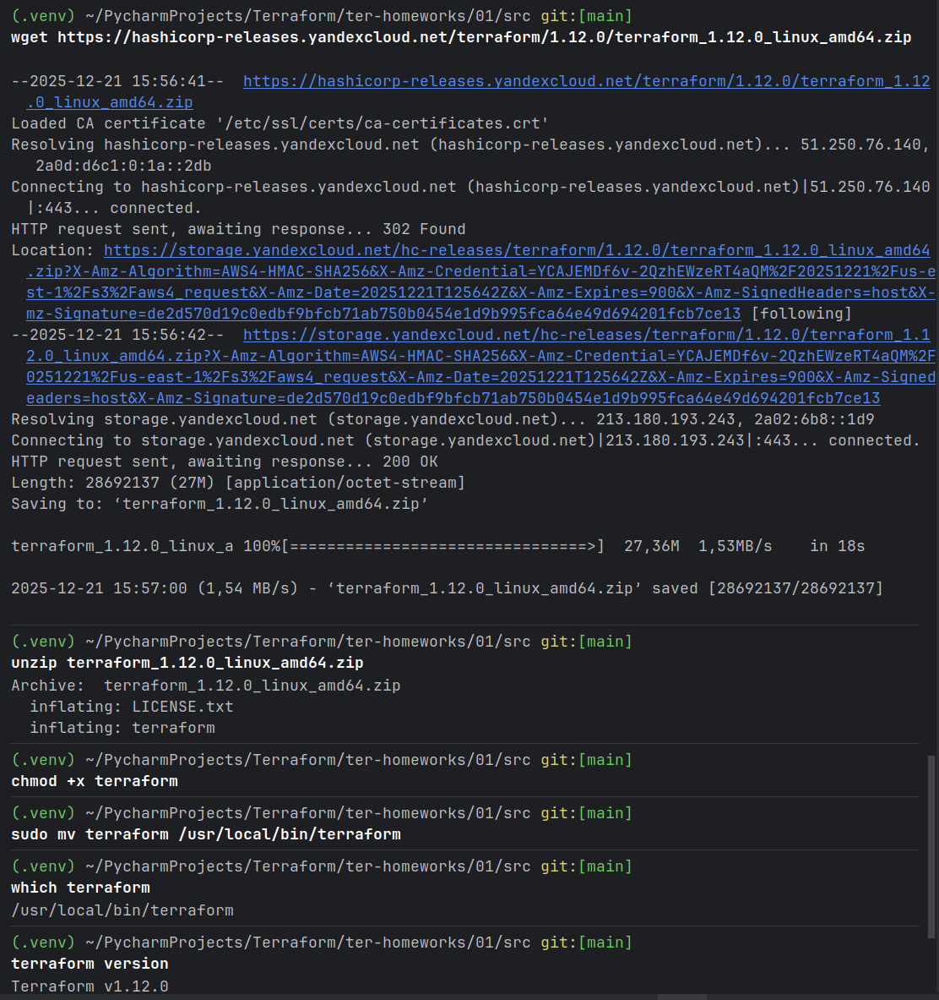
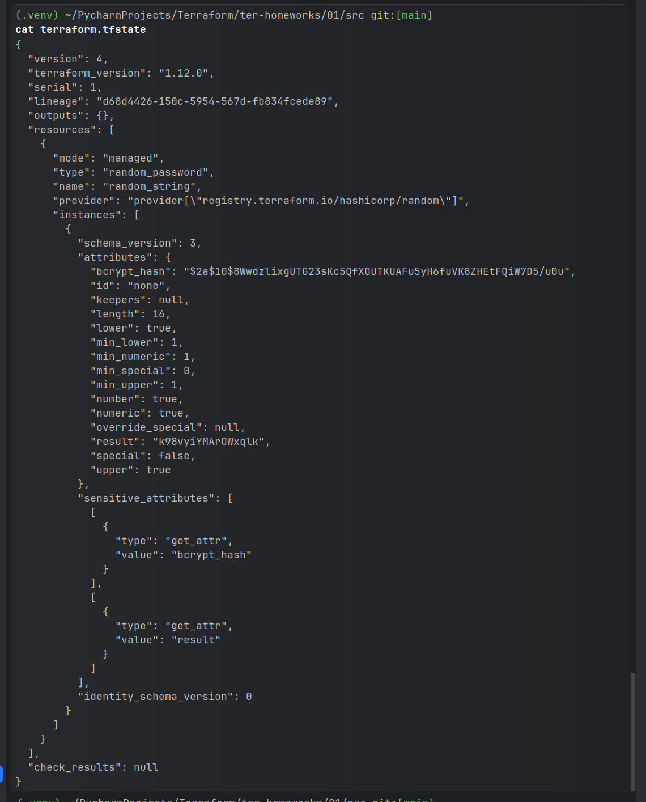
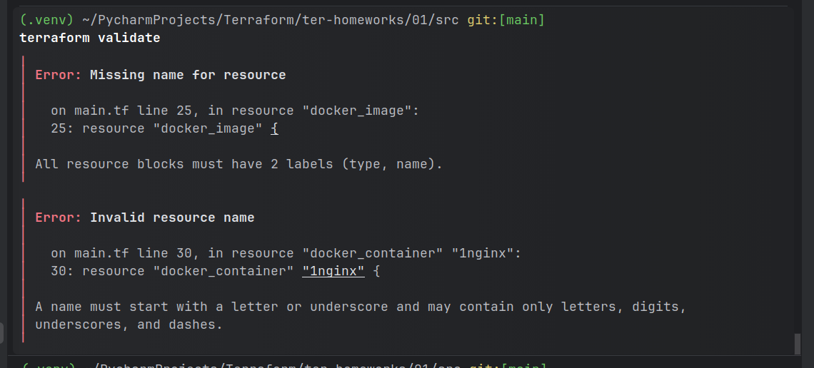
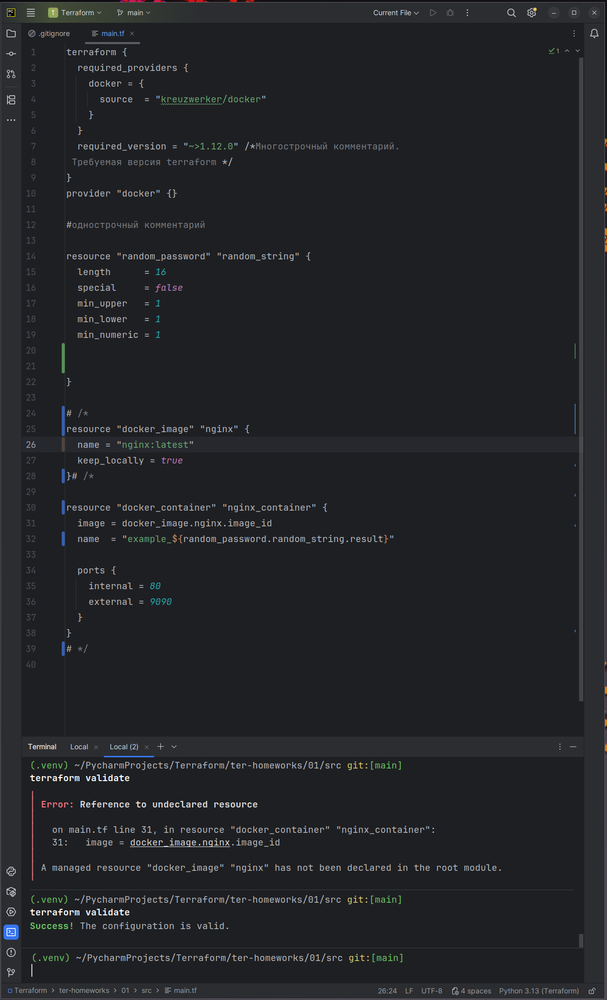
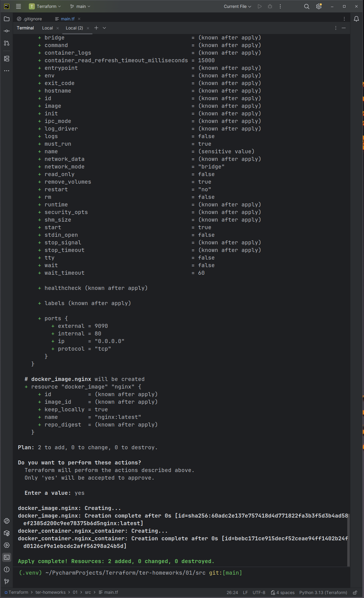
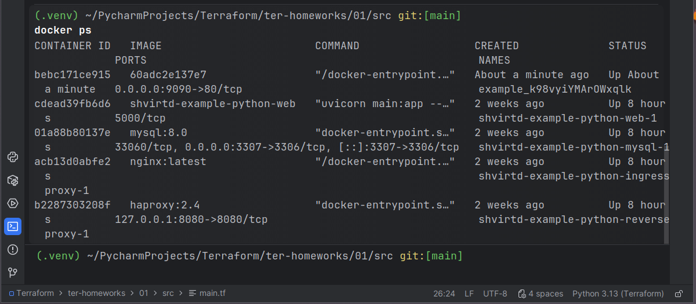
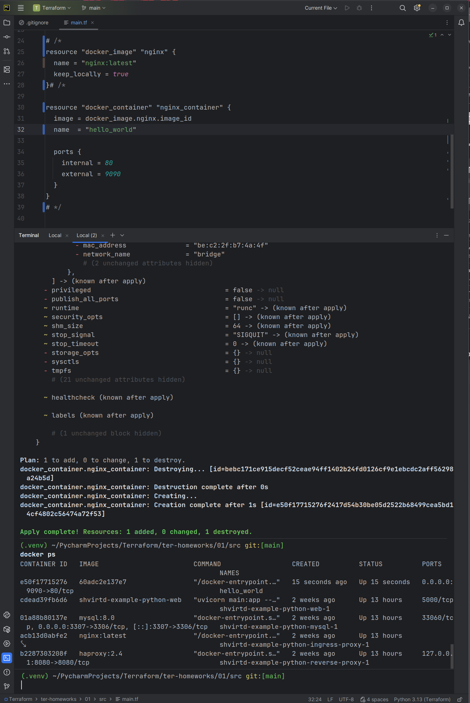
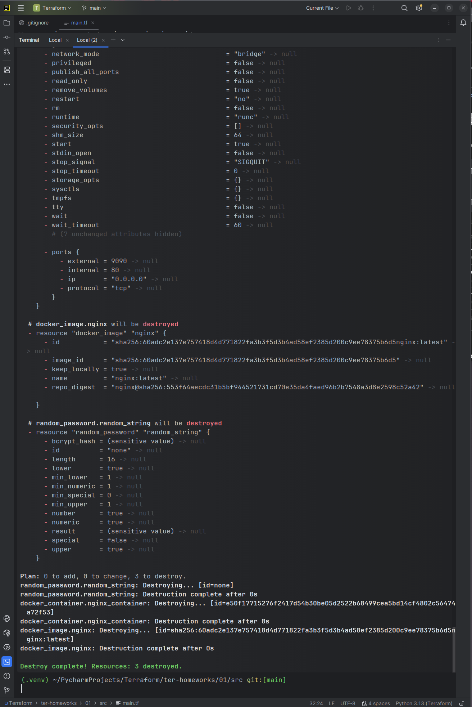
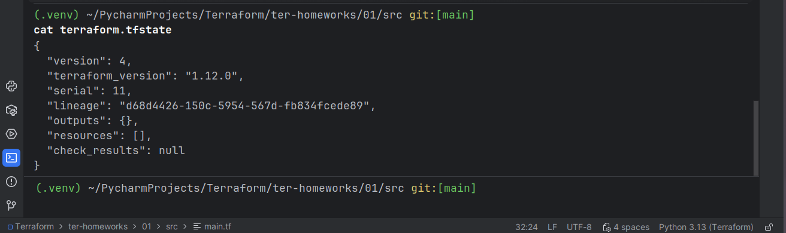

  Перед началом шпаргалка
  ```
terraform validate # проверка синтаксиса
terraform init    # инициализация
terraform plan    # показать, что будет создано
terraform apply   # создать сервер
terraform destroy # удалить сервер

  ```
  
  **Скачайте и установите Terraform версии >=1.12.0 . Приложите скриншот вывода команды `terraform --version`**
качаю нужную версию:  
```
 wget https://hashicorp-releases.yandexcloud.net/terraform/1.12.0/terraform_1.12.0_linux_amd64.zip\n
```
распаковываю:  
```
 unzip terraform_1.12.0_linux_amd64.zip
```
разрешаю и перемещаю:  
```
chmod +x terraform
sudo mv terraform /usr/local/bin/terraform

```



**В каком terraform-файле, согласно этому .gitignore, допустимо сохранить личную, секретную информацию?(логины,пароли,ключи,токены итд)**
Ответ:  
personal.auto.tfvars  
он прописан в .gitignore поэтому ничего не попадает в сеть.     

создать ресурс `random_password` и посмотреть его значение в state:
```
terraform init
terraform apply
cat terraform.tfstate
```

Смотрю пароль


пароль - "result": "k98vyiYMArOWxqlk"

**Раскомментируйте блок кода, примерно расположенный на строчках 29–42 файла main.tf. Выполните команду `terraform validate`. Объясните, в чём заключаются намеренно допущенные ошибки. Исправьте их.**
  
написано: строчка 25 - недостает имя ресурса. Все ресурсовые составляющие должны иметь в описании 2 составляющих тип и название

строка 30 - название должно начинаться с буквы или __ (подчеркивания). Имя должно состоять из букв,цифр,подчеркиваний, тире. 

**Исправляю**  
в resource "docker_image" { дописываю image = docker_image.nginx.image_id}  


**- Выполните код. В качестве ответа приложите: исправленный фрагмент кода и вывод команды `docker ps`.**

ввожy ``` terraform apply```  



  **`terraform apply -auto-approve`**
- Строит план
- Сразу применяет его
- Без запроса подтверждения
**ИМЯ ОБРАЗА**
```
resource "docker_image" "nginx" {
  name         = "nginx:latest"   # ← ИМЯ ОБРАЗА
  keep_locally = true
}
```
`nginx:latest` — имя Docker-образа
Оно соответствует `docker pull nginx:latest`  

**Имя Docker-контейнера**  

```
resource "docker_container" "nginx_container" {
  image = docker_image.nginx.image_id
  name  = "example_${random_password.random_string.result}"  # <- ИМЯ КОНТЕЙНЕРА
```
 
Вывод - ```
-auto-approve``` нужен при автоматическом деплое, когда нет того кто введет YES

**Уничтожьте созданные ресурсы с помощью terraform. Убедитесь, что все ресурсы удалены. Приложите содержимое файла terraform.tfstate.**
```
terraform destroy -auto-approve

```
  
  

**Объясните, почему при этом не был удалён docker-образ nginx:latest**
```
resource "docker_image" "nginx" {
  name         = "nginx:latest"
  keep_locally = true
}
```
`keep_locally = true` - **запрещает Terraform удалять docker-образ**
[](https://registry.terraform.io/providers/kreuzwerker/docker/latest/docs/resources/image?utm_source=chatgpt.com#keep_locally-1)(Boolean) If true, then the Docker image won't be deleted on destroy operation. If this is false, it will delete the image from the docker local storage on destroy operation.

`keep_locally` (Boolean) If true, then the Docker image won't be deleted on destroy operation. If this is false, it will delete the image from the docker local storage on destroy operation.   

источник: 
https://library.tf/providers/kreuzwerker/docker/latest/docs/resources/image  
