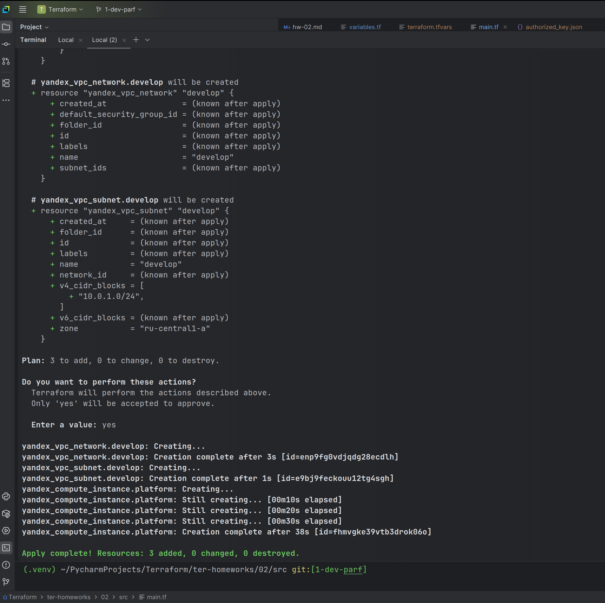
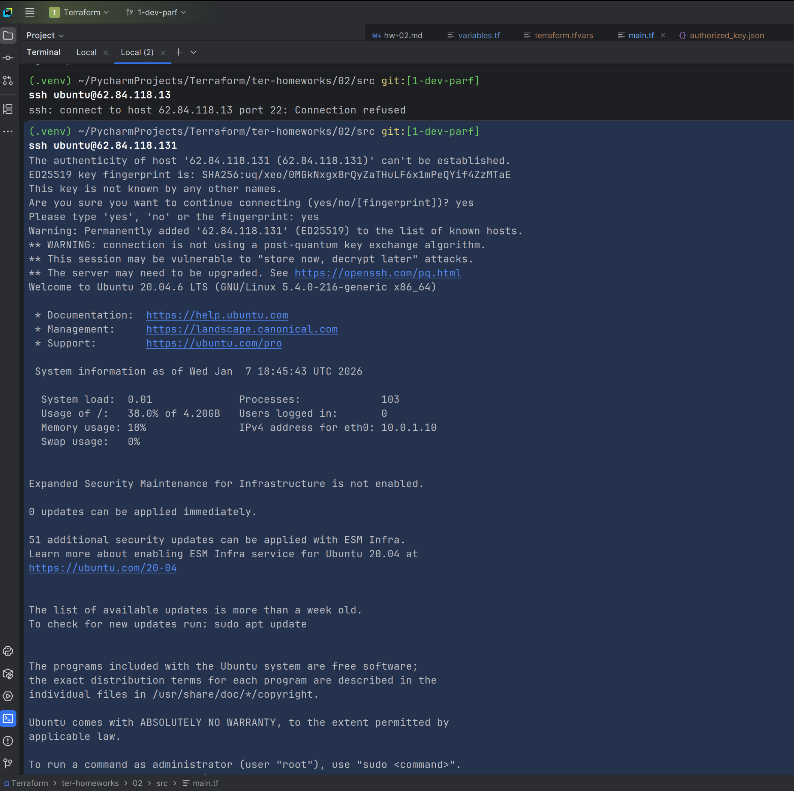
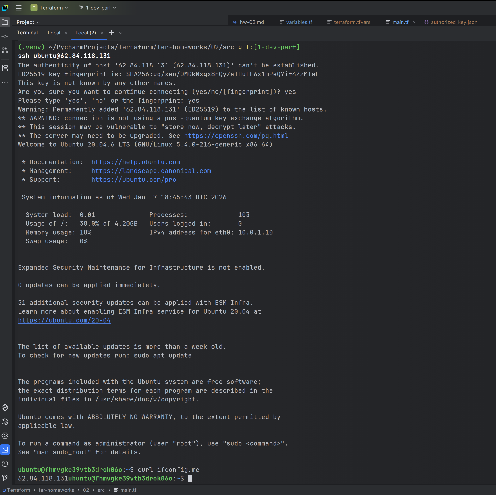
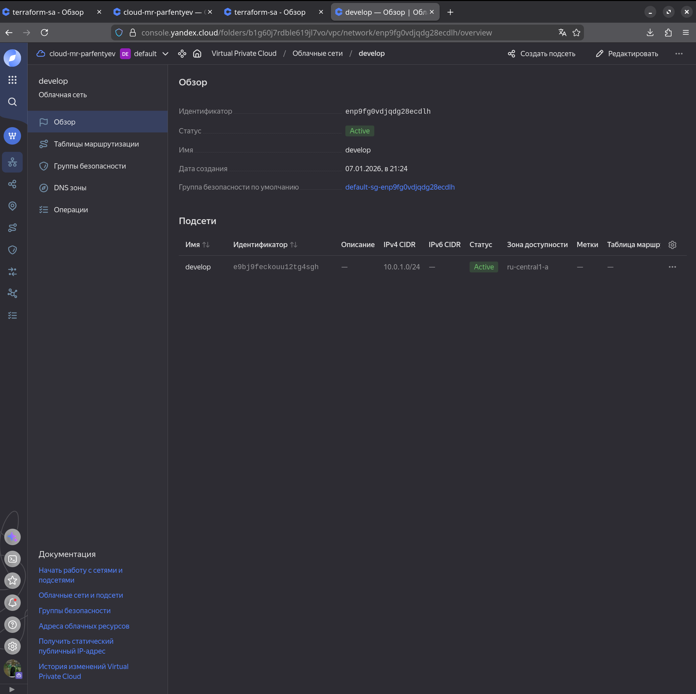
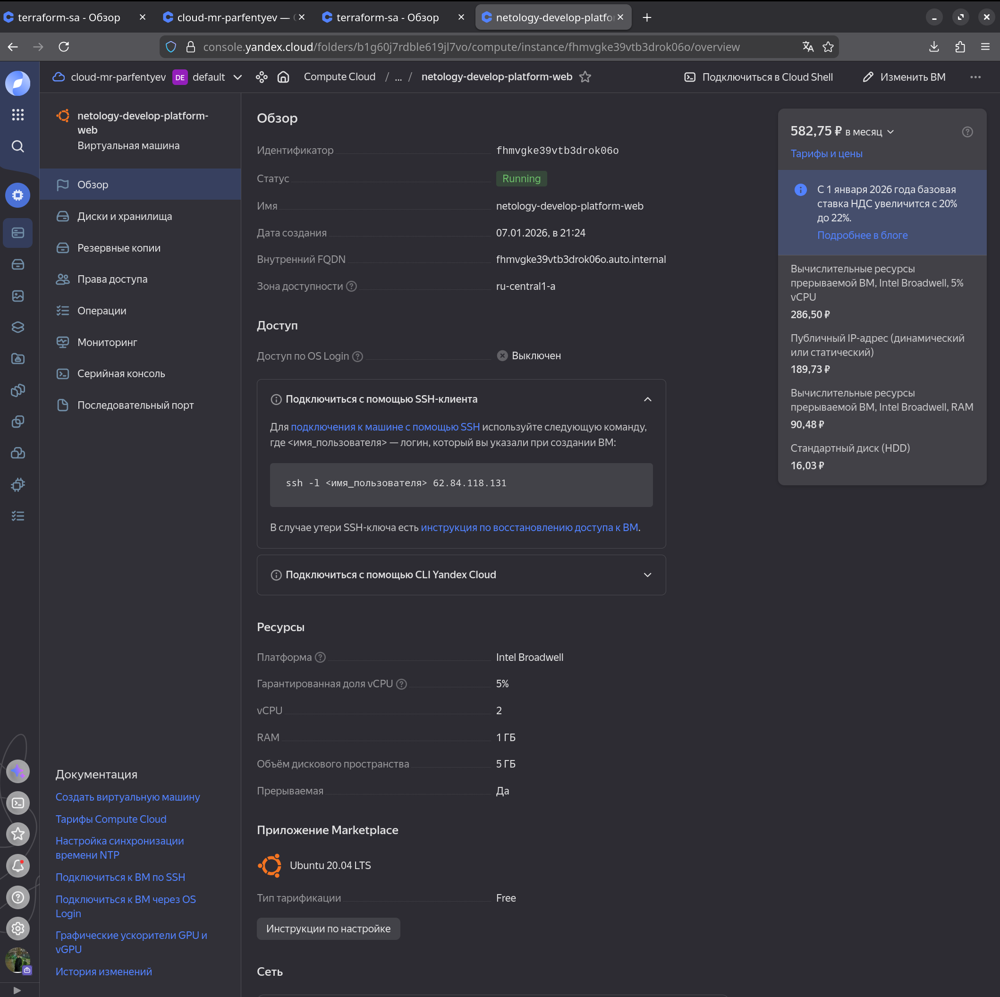
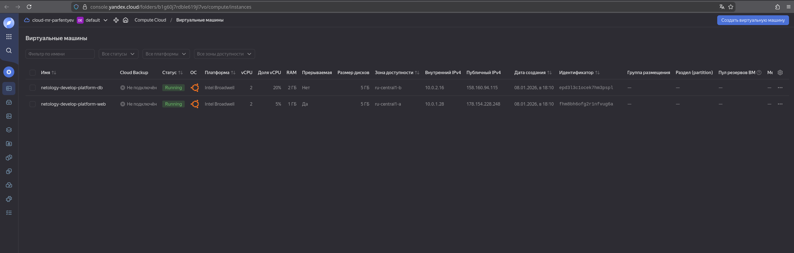
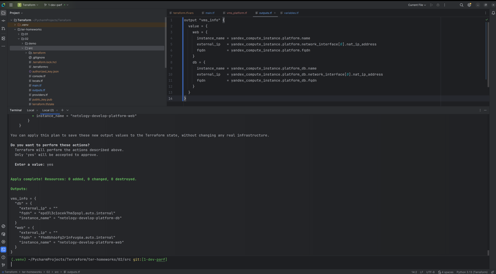
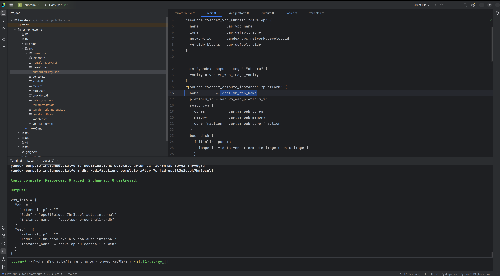

### ссылка на GitHub с дз
https://github.com/netology-code/ter-homeworks/blob/main/02/hw-02.md

##  Задание 1
### Цель:
У меня есть проект где за меня все описано, надо скачать ключик(разобравшись в графомании яндекса) и запулить на сервер инструкции по созданию ресурсов

### Как это сделать? 
- 1 Записывать идентификаторы: нужен cloud_id - https://console.yandex.cloud/cloud/b1g3ng83dmgav8l9flbq
  b1g3ng83dmgav8l9flbq
  и нужен folder_id - https://console.yandex.cloud/folders/b1g60j7rdble619jl7vo/iam/service-account/ajethj120s8jc1spn9i8
  b1g60j7rdble619jl7vo
- 2 Эти значения надо указать в terraform.tfvars
  
### Тераформа ругалась
вот один из моментов где ругалась тераформа 
name        = "netology-develop-platform-web"  
platform_id = "standard-v1"  
resources {  
  cores         = 2  
  memory        = 1  
  core_fraction = 5  
}
не нравилось platform_id = "standart-v4"  
это внутринние прописи яндекса по выбору мощи ресурса и 1 ядро не входило в v4, насколько я понял там минимально 2

### Скрин успешного terraform apply

### Пункт 5
Подключитесь к консоли ВМ через ssh и выполните команду `curl ifconfig.me`.

в main.tf добавил output "platform_public_ip" {  
  value = yandex_compute_instance.platform.network_interface[0].nat_ip_address  
}
чтобы увидеть ip 
platform_public_ip = "62.84.118.131" 

убеждаюсь что ключ добавлен в ssh агент 
eval $(ssh-agent)
Agent pid 124123

выполняю curl ifconfig.me

### preemptible = true
Эта запись значит что машина прерываема
 В учебных целях создаем машины. Главное не сама машина а научиться писать код для ее создания - в этом цель. 
### core_fraction = 5
Минимальная CPU нагрузка, можно запускать много учебных ВМ одновременно, экономя ресурсы и деньги.

### Итог 
Создана машина 

в отвратительном интерфейсе яндекса найдена вкладка с ip виртуальной машины

Где смотреть виртуальные машины: https://console.yandex.cloud/folders/b1g60j7rdble619jl7vo/compute/instances

## Задание 2

Заменил переменные, импортировал в main.tf

### Задание 3
Создано 2 виртуалки тераформой - перемога! 

### Задание 4
создал output.tf и применил изменения 

### Задание 5 - locals
Заменил переменные - опять 
